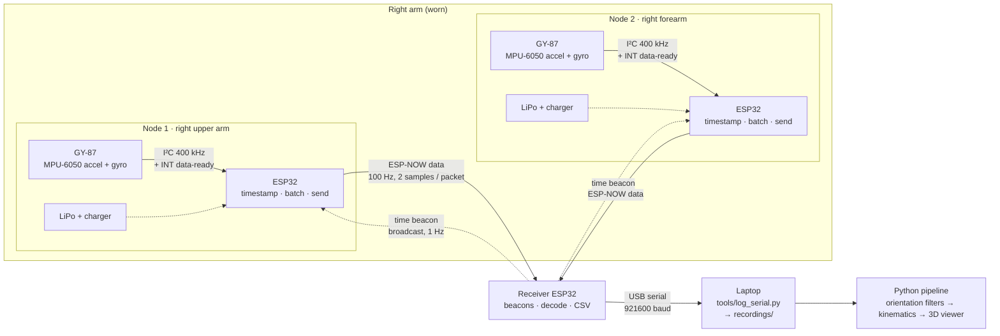
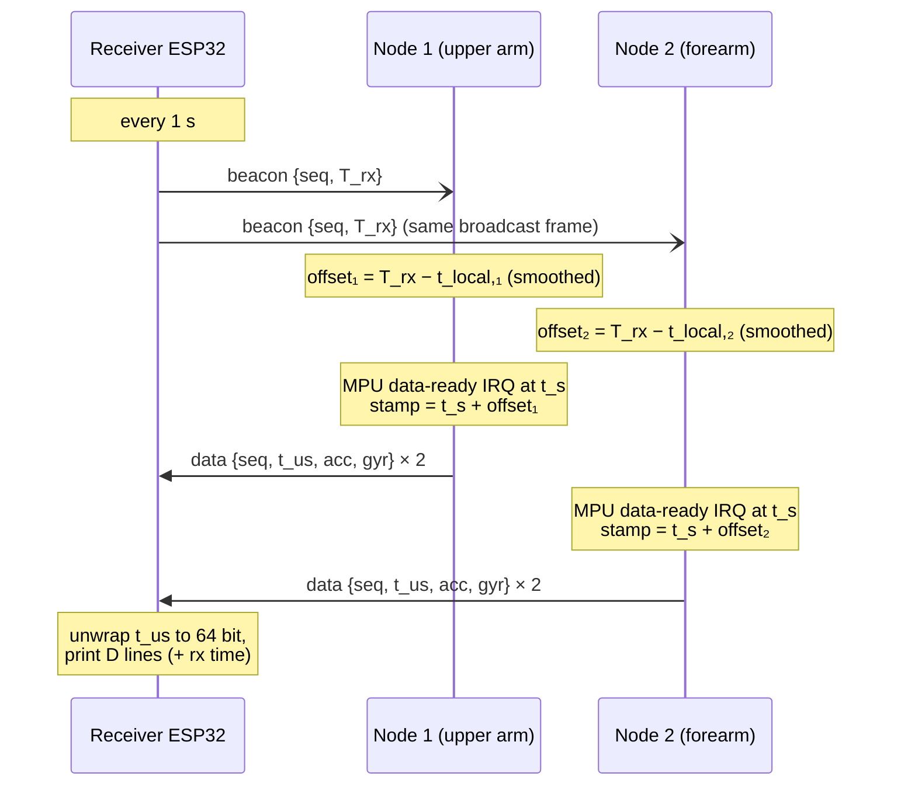
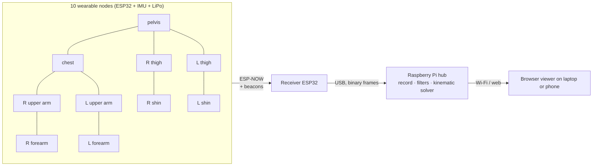

# Hardware: Wireless IMU Nodes

How real sensors get into the pipeline. This is the Phase 3 bring-up plan: **two
wearable nodes on the right arm → one receiver ESP32 → laptop**. The Raspberry Pi
hub and the full 10-node suit come later (see [Scaling to 10 nodes](#scaling-to-10-nodes--raspberry-pi)).

Firmware lives in [`firmware/`](firmware/), and the laptop-side logger is [`tools/log_serial.py`](tools/log_serial.py).

---

## Full picture: step 1 (2 nodes, no Raspberry Pi)



Each node samples its IMU, stamps every sample with a clock that is synced to
the receiver, and sends raw counts. **All fusion happens on the host.** This
follows the research design's rule to never discard raw data: the same recording
can be replayed through the complementary, Madgwick/Mahony and EKF filters for a
fair comparison.

---

## Bill of materials (step 1)

| Qty | Part | Notes |
|-----|------|-------|
| 3 | ESP32 boards | 2 sensor nodes + 1 receiver. Any ESP32 / C3 / S3 works; the pins are set at the top of each sketch. |
| 2 | GY-87 10DOF module | MPU-6050 (accel + gyro) + HMC5883L/QMC5883L (mag) + BMP180 (unused). Edison store, 17 ₾. |
| 2 | 1S LiPo 300–500 mAh + charger/protection | Only needed once the nodes are worn. On the bench, USB power is fine. |
| — | Straps, 3D-printed cases | Rigid case with the sensor axes marked on the outside. |

### Wiring (per node, classic ESP32 DevKit defaults)

| GY-87 pin | ESP32 pin | Sketch constant |
|-----------|-----------|-----------------|
| VCC_IN (3–5 V) | 5V / VIN, **or** ESP32 3V3 → GY-87 3.3V pin | — |
| GND | GND | — |
| SDA | GPIO 21 | `PIN_SDA` |
| SCL | GPIO 22 | `PIN_SCL` |
| INTA | GPIO 19 | `PIN_MPU_INT` |

The GY-87 has on-board I²C pull-ups. If INTA isn't wired, set `USE_DRDY_INT 0`: the
node will poll instead, with slightly worse timestamp jitter.

At boot each node prints an I²C scan. On a GY-87 you should see `0x68` (MPU-6050),
`0x77` (BMP180) and either `0x1E` (genuine HMC5883L) or `0x0D` (QMC5883L clone). The
magnetometer only shows up because the firmware enables the MPU-6050's I²C bypass.

---

## How fast can the sensor produce data?

| Item | Limit | What we use |
|------|-------|-------------|
| MPU-6050 gyro output rate | 8 kHz (DLPF off) / 1 kHz (DLPF on) | DLPF on, 42 Hz bandwidth |
| MPU-6050 accel output rate | 1 kHz | — |
| Sample rate | `1 kHz / (1 + SMPLRT_DIV)` | **100 Hz default** (`SAMPLE_HZ`), 200 Hz for fast moves |
| I²C burst read (14 bytes at 400 kHz) | ≈ 0.4–0.5 ms, so ~2 kHz theoretical ceiling | ~5% of the bus at 100 Hz |
| HMC5883L magnetometer | 75 Hz continuous (160 Hz single-shot) | Not read yet (optional channel) |
| QMC5883L clone | up to 200 Hz | Not read yet |

In practice the sketch supports 100, 125, 200, 250 and 500 Hz. Most voluntary human
movement sits below ~10–20 Hz, so **100 Hz** (the research design's default) is enough.
Use 200 Hz for fast gestures, impacts or falls. Default ranges are **±8 g** and
**±1000 °/s**, which leaves headroom for a fast wave.

---

## How fast can we send it?

ESP-NOW sends up to **250 bytes per packet** with no Wi-Fi connection or router
needed. Our packet is a 17-byte header plus 26 bytes per sample, with up to 8 samples
per packet (`BATCH`).

| Setup | Packets/s | Payload | Rough airtime at the default 1 Mbps PHY* |
|-------|-----------|---------|-------------------------------------------|
| 2 nodes × 100 Hz, batch 2 | 100 | ~7 KB/s | ~15% |
| 2 nodes × 200 Hz, batch 2 | 200 | ~14 KB/s | ~30% |
| 10 nodes × 100 Hz, batch 2 | 500 | ~35 KB/s | ~80%: too tight |
| 10 nodes × 100 Hz, batch 4 | 250 | ~30 KB/s | ~50% |
| 10 nodes × 100 Hz, batch 4, 6 Mbps PHY | 250 | ~30 KB/s | ~10% |

\*Estimates: each unicast packet costs ~1.5–2 ms of air at 1 Mbps (preamble + headers
+ ACK). They're only for choosing settings. The receiver prints the **measured**
packets/s, loss and latency every 2 s (`S` lines), so use those numbers.

The trade-offs:
- **Batching adds latency.** A batch of N at rate f waits (N−1)/f before sending: 10 ms for batch 2 at 100 Hz. That's still far inside the <100 ms budget.
- **The USB link is the next bottleneck.** 921600 baud ≈ 92 KB/s, and the CSV lines are ~90 characters, so ~1000 lines/s. That's fine for 2 nodes (200 lines/s) but full at 10 nodes × 100 Hz, so switch to binary framing or the Raspberry Pi then.
- **Pick a quiet Wi-Fi channel** (`ESPNOW_CHANNEL` in `imu_protocol.h`, default 1). Nearby Wi-Fi networks share the airtime.

---

## Time sync

Every ESP32 has its own crystal, so node clocks disagree and drift apart by tens of
ppm (tens of ms per hour). Without sync, "sample 500 from node 1" and "sample 500
from node 2" are not the same instant. The fix has two parts: **timestamp each sample
when it's measured, in a shared clock**.



1. **Beacon.** The receiver broadcasts `{seq, T_rx}` every second, where `T_rx` is its
   `esp_timer_get_time()` just before sending.
2. **Offset.** Each node records its own time when the beacon arrives and computes
   `offset = T_rx − t_local`. The first beacon sets it directly. Later beacons move it
   ¼ of the way (smoothing out jitter), and a jump > 2 ms (e.g. the receiver rebooted)
   resets it.
3. **Timestamp at measurement.** The MPU-6050's INT pin fires at each new sample. The
   interrupt records `t_local` immediately, and the sample is stamped `t_local + offset`,
   i.e. in receiver time. Stamping at send time would add the batching and radio
   delays as timing error.
4. **Sequence numbers.** Every sample has a counter, so the host can see exactly which
   samples were lost (`lost_total` in `S` lines).
5. **Flags.** `FLAG_SYNCED` is cleared if no beacon has arrived for 10 s, so the host
   knows not to trust that packet's timestamps.

**Expected accuracy.** Both nodes hear the *same* broadcast frame, so the unknown
radio delay (a few hundred µs) is almost identical for them and cancels when you
compare node 1 to node 2. What's left is callback jitter (tens of µs) plus crystal
drift between beacons (≤ ~20 µs per second). Node-to-node alignment should be
**well under 1 ms**, versus a 10 ms sample period. This has to be measured (next
section), not assumed.

**Measuring it (tap test).** Hold both nodes together and tap them sharply on a table
a few times. The impact spike appears in both accelerometer streams, and the time
difference between the two spikes is the sync error. Repeat after 10 minutes to check
for drift. This is a clean experiment for RQ3 (how timing error propagates into pose
error).

The receiver also reports `latency_ms` = arrival time − sample time for the newest
sample in each packet. That's the sensor-to-receiver latency, including batching.

---

## Packet format (protocol v1)

Defined in [`firmware/*/imu_protocol.h`](firmware/sensor_node/imu_protocol.h) (two
identical copies, one per sketch). All fields are little-endian.

**Beacon** (receiver → broadcast, 14 bytes): `magic, version, type=2, beacon_seq, rx_time_us (u64)`

**Data** (node → receiver, 17 + 26·n bytes):

| Field | Type | Meaning |
|-------|------|---------|
| magic / version / type | u16 / u8 / u8 | `0x3D5D` / 1 / 1 |
| node_id, segment_id | u8, u8 | segment IDs listed in the header (`SEG_R_UPPER_ARM = 2`, `SEG_R_FOREARM = 3`, …) |
| n, flags | u8, u8 | samples in packet; `SYNCED`, `MAG_VALID`, `OVERRUN`, `LOW_BATT` |
| pkt_seq, batt_mv | u16, u16 | packet counter; battery (0 = not measured) |
| sample_hz, acc_fs_g, gyr_fs_dps | u16, u8, u16 | lets the host convert counts to units |
| per sample: t_us | u32 | low 32 bits of the timestamp (the receiver rebuilds 64 bit) |
| per sample: seq | u16 | sample counter |
| per sample: acc[3], gyr[3], mag[3], temp | i16 | raw counts |

Unit conversion on the host: `acc [g] = counts × acc_fs_g / 32768`,
`gyr [°/s] = counts × gyr_fs_dps / 32768`, `temp [°C] = counts / 340 + 36.53`.

This covers the fields the project brief asks for (sensor ID, segment ID, timestamp,
battery, signal quality via RSSI) plus the design's sequence number and status flags.
Orientation quaternions are **not** sent: they're computed on the host.

---

## Serial output (receiver → laptop)

921600 baud, one line per record:

```
# ... comment / column descriptions
N,node,segment,sample_hz,acc_fs_g,gyr_fs_dps,mac                 (first packet from a node)
D,node,segment,seq,t_us,ax,ay,az,gx,gy,gz,mx,my,mz,temp,flags,batt_mv,rssi,rx_us
S,node,pkts_per_s,samples_per_s,lost_total,rssi,latency_ms,synced,batt_mv   (every 2 s)
```

`python tools/log_serial.py --port /dev/ttyUSB0` saves the `D` lines to
`recordings/<timestamp>/imu_raw.csv`, the node info to `meta.json`, and prints the
`S` lines live. Recordings stay out of git (see `.gitignore`).

---

## Placement for step 1 and calibration

| Node | Segment | Where | Why |
|------|---------|-------|-----|
| 1 | `SEG_R_UPPER_ARM` | outside of the right upper arm, mid-way between shoulder and elbow | flat, little muscle movement |
| 2 | `SEG_R_FOREARM` | back of the right forearm, just above the wrist | bony, so soft-tissue wobble is small |

- **Mount them the same way every session.** The sensor-to-segment rotation `q_SB` is estimated from a calibration pose, but a consistent mount keeps it repeatable.
- **Calibration pose:** stand still with arms hanging, palms facing the thighs, for 3 s at the start of each recording. That's the N-pose the model's rest pose uses.
- **Without a chest node**, the upper arm's orientation is relative to the world, not the torso. That's fine for the first elbow experiments if the person stands still. The chest node should be the third one built.

---

## Step 1 checklist

1. **Bench bring-up.** Flash the receiver, then flash node 1 (`NODE_ID 1`, `SEG_R_UPPER_ARM`) and node 2 (`NODE_ID 2`, `SEG_R_FOREARM`). Both node LEDs go solid once paired and synced.
2. **Rates.** Check the receiver's `S` lines show ~100 samples/s per node, 0 lost, and `synced = 1`.
3. **Static noise and bias.** Leave both nodes still for 15 minutes and record. This gives the real gyro bias and noise, which feed the simulator's noise model (the research design's "virtual IMU" error injection).
4. **Sync.** Run the tap test at t = 0 and t = 10 min.
5. **First motion.** Record elbow flexion 0→90→0° against a protractor or phone inclinometer. The elbow angle from the two nodes is the first real pose measurement (the relative rotation `q_UF = q_WU⁻¹ ⊗ q_WF`).

---

## Scaling to 10 nodes + Raspberry Pi



Things that change at 10 nodes:
- **Radio.** Raise the ESP-NOW PHY rate and/or use batch 4 (see the table above).
- **USB link.** Switch from CSV to binary framing between receiver and host.
- **Hub.** The Raspberry Pi takes over recording, filters and the kinematic solver, and serves the viewer to a browser (rendering on the Pi itself would be slow).
- **Sensor-count study.** With 10 nodes you can drop streams in software to compare 8 / 6 / 4 / 2 sensors (RQ2) without rewiring.
- **Boards.** Wearable-friendly boards (e.g. a small ESP32-C3/S3 with a built-in LiPo charger) replace plain DevKits. A DevKit's AMS1117 regulator is a poor match for a single LiPo cell.
