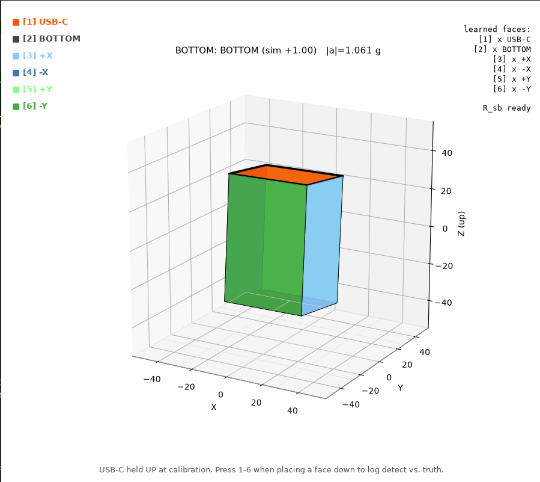
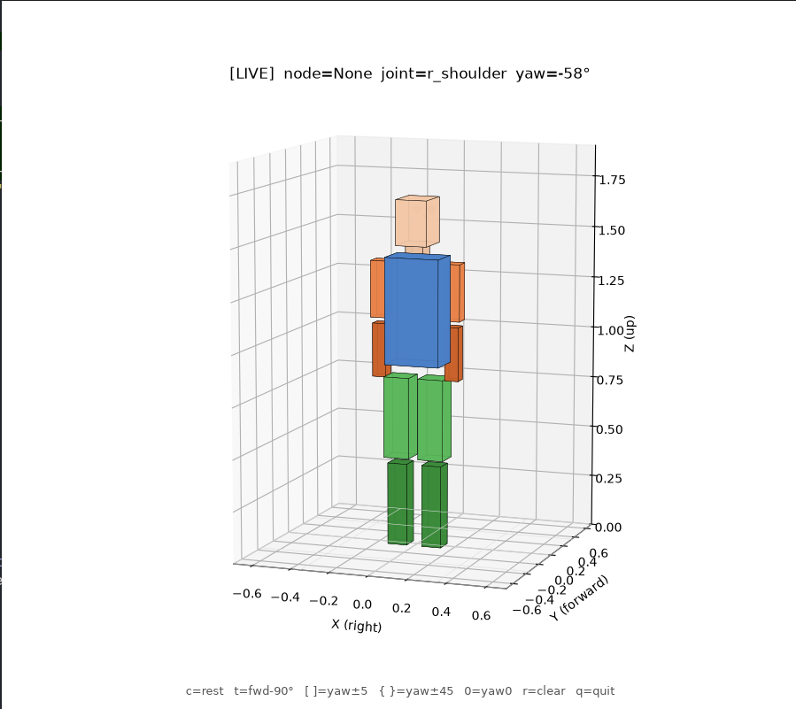

# 3DSM — Sensor 3D Modeler

### ▶ [Open Live Demo](https://flashdato.github.io/3DSM_Project/)

**Intelligent Sensor Fusion for 3D Human Modelling**, a master's research project.
Wearable IMUs on each body segment, fused with a kinematic body model to reconstruct
3D human motion in real time.

[Project reference](PROJECT.md) · [Roadmap](PLAN.md) · [Hardware](HARDWARE.md) · [Changelog](CHANGELOG.md)

<!-- VERSION START: replace this block on every release; older versions go to CHANGELOG.md -->

## Current version: v0.4 — Wireless IMU + per-sensor box & arm viz

*8 Oct 2026*

Real GY-87 hardware now drives the model wirelessly. Mounting calibration is
learned once per sensor and persisted, so launches start in LIVE mode.





### What works end-to-end

- **ESP-NOW link.** `firmware/esp32_sensor_now/` (worn, battery-powered) streams
  raw IMU over broadcast ESP-NOW at 200 Hz. `firmware/esp32_receiver_now/`
  (USB-tethered) prints to the host at 1 Mbaud. No pairing — a power-cycled
  sensor is live again the moment it boots, and the receiver prints
  `# node X online (seq N)` on first packet.
- **Multi-node ready.** Each sensor stamps a compile-time `NODE_ID`; the
  receiver tracks per-node sequence and drop counts.
- **Box visualizer** (`tools/visualize_box_gy87.py`). Press 1-6 while a face is
  down to teach the sensor-to-box mounting; a Kabsch solver turns the six
  accel vectors into `R_sb`. A Mahony-style accel+gyro complementary filter
  (no mag — the clone QMC5883P is unusable) then drives the live box through
  flips, rolls and spins without the yaw-pole flickering a pure "shortest
  rotation" would have. Gyro bias is calibrated both at firmware boot and
  refined online when the box is stationary. Mounting persists to
  `calibrations/box_calib_node<N>.json`.
- **Arm visualizer** (`tools/visualize_arm_now.py`). Loads the box tool's
  `R_sb`, runs the same filter, and drives the HumanModel's right shoulder.
  Two-key anchor: `c` captures rest, `t` captures a forward-raise 90° and
  solves the yaw correction so your physical forward lines up with
  HumanModel's +Y. Both save to `calibrations/arm_rest_node<N>.json` and
  auto-load next launch — one-and-done per strap setup.

### Next

- Validate elbow / wrist nodes alongside the shoulder sensor.
- Multi-sensor concurrent streaming test (per-node Kabsch + anchor).
- Measurement runs vs. protractor (shoulder angle error, elbow angle error).

<!-- VERSION END -->

## Quick start

```bash
pip install -r requirements.txt
python src/main.py                               # right-arm demo (--full for whole body)
python tools/log_serial.py --port /dev/ttyUSB0   # record from the receiver ESP32
```

Flashing the ESP32s: [`firmware/README.md`](firmware/README.md). More commands, the
repository layout and conventions: [`PROJECT.md`](PROJECT.md).
